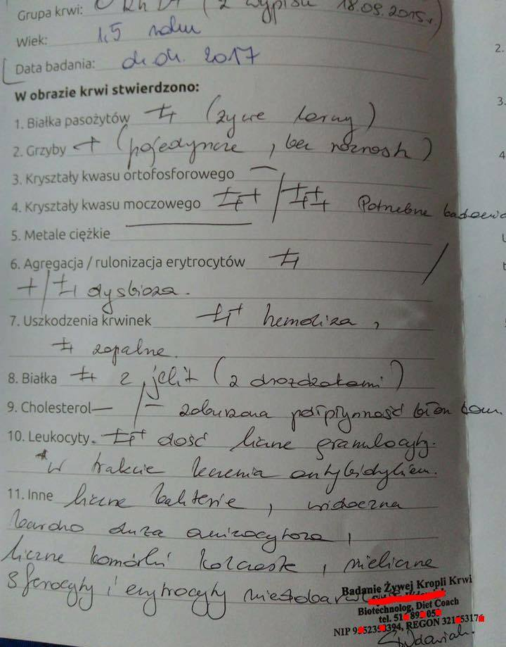
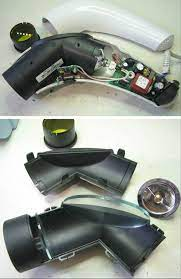

```{r,echo=FALSE}
## Set default options for the knitr RMD processing
knitr::opts_chunk$set(echo=FALSE,warning=FALSE,message=FALSE,fig.width=5,fig.height=5,cache=FALSE,autodep=TRUE, results="hide")
library(pander)
library(knitr)
library(kableExtra)
#source("functions.R")
```

```{r echo=FALSE,include=FALSE,eval=TRUE}
options(crayon.enabled = TRUE)
options(crayon.colors = 256)
knitr::knit_hooks$set(output = function(x, options){
  paste0(
    '<pre class="r-output"><code>',
    fansi::sgr_to_html(x = htmltools::htmlEscape(x), warn = FALSE),
    '</code></pre>'
  )
})

## this is an ugly, ugly hack, but otherwise crayon does not LISTEN TO REASON!!!
num_colors <- function(forget=TRUE) 256
library(crayon)
assignInNamespace("num_colors", num_colors, pos="package:crayon")
```


```{r libraries,cache=FALSE}
library(tidyverse)
```


## Berlin Institute of Health

.pull-left[

 * Badania translacyjne i *precision medicine*

 * Założony w 2013 przez Max Delbrück Center for
   Molecular Medicine oraz Charité – klinikę uniwersytecką obu berlińskich
   uniwersytetów – Humboldt University i Free University Berlin.

 * Od 2020 oficjalnie "trzeci filar" Charité

]


???

Charité – over 15,000 employes

---

.center[
.myquote[
<span style="font-size:200%">Otwartość w nauce vs otwartość nauki</span>
]]


???

Otwartość nauki to także otwartość na laików

---

.center[
.myquote[

[https://january3.github.com/OPOS/](https://january3.github.com/OPOS/)

]]

---

.pull-left[

Rewelacja!

 * Urządzenie oddziaływuje bezpośrednio z naszym układem nerwowym przez
   wytwarzanie cząstek elementarnych
 
 * Cząstki elementarne wytwarzane są w wyniku transmutacji energii

 * Proste w obsłudze

Olbrzymia liczba zastosowań:

 * Wzmacnia odbierane przez nas bodźce

 * Poprawia samopoczucie

 * Zmniejsza prawdopodobieństwo urazu

 * Polepsza zdolność odbierania bodźców przez nasz układ nerwowy

 * Może służyć do przekazywania myśli na odległość

]

--

.pull-right[


]

???

Do tego przykładu wrócimy jeszcze później

Żargon nauki jest trudny

---


.center[

]


???

w nawiązaniu do wykładu pana Krzysztofa Szymanka


---

##  	

<br/><br/>


.pull-left[
.myquote[
"Od twardej wody dostaje się kamienicy nerkowej"

<span style="text-align:right;">(anonimowy internauta)</span>
]
]

--

.pull-right[


"...imited data suggest possible benefit from dietary calcium."


]

???

szczawiany wywołują kamicę; szczawian wapnia jest nierozpuszczalny

wytrącanie szczawianu wapnia jeszcze w układzie pokarmowym

NAUKA JEST NIEINTUICYJNA


---


.pull-left[

.myquote[

"Niech bilardy dobra walczą z milionami zła." 

(strona prywatnego gabinetu
lekarskiego)

]
]

.pull-right[


]

???

Bakterii nie jest aż o 10 x więcej niż naszych komórek

Na przykład prawdą jest, że przeprowadzono test eksperymentalnej terapii
przeszczepiającej florę bakteryjną u osób cierpiących na autyzm. Jednak nie
był to test kliniczny, a tzw. *open label trial*, bez grupy kontrolnej i
bez zaślepienia (pacjenci i lekarze wiedzieli, kto i jakiemu poddawany jest
zabiegowi).


---


---

.pull-left[



]

--

.pull-right[

]

???

Na podstawie tego obrazu można z całą pewnością powiedzieć tylko jedno,
mianowicie gdzie znajduje się pacjent


---

.pull-left[

]

--

.pull-right[


]


---

.pull-left[


]

.pull-right[


]

???

Sprawa bardziej skomplikowana 

Układ odpornościowy można osłabić, ale nie wzmocnić

---
class:empty-slide,mywhite
background-image:url(images/wzmocnijodpornosc_2.png)

???

Glutation – GSH

nasze komórki syntetyzują go w wystarczających ilościach

suplementacja nie przynosi efektów


---


.center[
.myquote[
 <span style="font-size:250%">W samym roku 2018 w Polsce firmy farmaceutyczne wydały ponad 4 miliardy złotych
   na reklamy</span>
   ]
   ]

.myfootnote[
Źródła

 * [Raport Instytutu Monitorowania Mediów](https://www.imm.com.pl/branza-farmaceutyczna-liderem-rocznego-zestawienia-wydatkow-reklamowych-raport-imm-wydatki-reklamowe-w-wybranych-branzach-w-okresie-od-1-stycznia-do-31-grudnia-2018/)
 * [https://www.statista.com/statistics/589452/value-dietary-supplements-markets-europe-by-country/](https://www.statista.com/statistics/589452/value-dietary-supplements-markets-europe-by-country/)
   ]


--
 
.center[
.myquote[
 <span style="font-size:250%">Polski rynek suplementów diety jest na piątym
 miejscu w Europie
   </span>
   ]
   ]

 
---

.myquote[
Kup sobie coś na wątrobę!
]

--

.pull-left[

]

--

.pull-right[


]


???


niealkoholowa stłuszczeniowa choroba wątroby w wyniku niedoboru choliny,
ale nadmiar choliny nie leczy choroby wątroby wywołanej np. spożyciem
alkoholu

odwrócenie przyczynowości

asparaginian ornityny stosowany przy leczeniu encefalopatii w wyniku
marskości wątroby i wywołanego nią podwyższenia poziomu amoniaku we krwi

Niby prawda, a smakuje jak oszustwo: nie wspomina się o tym, że
dotyksyfikować detoksyfikuje, ale tylko jedną określoną substancję w bardzo
specyficznych warunkach!


---

.pull-left[

Rewelacja!

 * Urządzenie oddziaływuje bezpośrednio z naszym układem nerwowym przez
   wytwarzanie cząstek elementarnych
 
 * Cząstki elementarne wytwarzane są w wyniku transmutacji energii

 * Proste w obsłudze

 * Wzmacnia odbierane przez nas bodźce

 * Poprawia samopoczucie

 * Zmniejsza prawdopodobieństwo urazu

 * Polepsza zdolność odbierania bodźców przez nasz układ nerwowy

 * Może służyć do przekazywania myśli na odległość

]

.pull-right[  ]


---

.pull-left[

Istnieje specjalistyczna terapia w której światło widzialne wykorzystywane
jest to aktywowania fotouczulaczy (wstrzykiwanych lokalnie), żeby
targetować nowotwory...

...w takim razie, czy wystarczy poświecić na raka, żeby zniknął?
]

--

.pull-right[

]

???

leczenie raka światłem: istnieje prawdziwa terapia, PDT, polegająca na podaniu
fotouczulacza, który następnie aktywuje się światłem


---

.pull-left[

.myquote[

They're doing everything right. The form is perfect. It looks exactly the
way it looked before. But it doesn't work. No airplanes land. So I call
these things cargo cult science, because they follow all the apparent
precepts and forms of scientific investigation, but they're missing
something essential, because the planes don't land.

Richard Feynman

]]

.pull-right[


]

???

Kult kargo

Nie ma nic nieracjonalnego w samym działaniu mieszkańców Papui Nowej Gwinei

=> działa, bo przyciąga turystów

---

## Studia obserwacyjne vs zrandomizowane testy kliniczne (RCT)

.pull-left[

"Real world" (observational) studies:

 * nieuprawnione porównania (apples to oranges)
  * problemy z właściwymi grupami kontrolnymi
  * brak kontroli systematycznych błędów
 * nieplanowane porównania (*post hoc*)
  * ułatwia cherry-picking 

]


.pull-right[

RCT:


 * randomizacja *jednej* grupy ochotników
  * grupy mają te same cechy (poza kontrolowanym zabiegiem)
  * nie ma systematycznych niekontrolowanych różnic
 * planowana analiza uniemożliwia (utrudnia) cherry-picking


*pierwszy RCT – 1948*

]

???

Czym jest ta istotna rzecz: testy kliniczne

 - Fisher published his book in 1935
 - Ethics: streptomycin was scarce anyway


---

class:empty-slide,mywhite
background-image:url(images/schemat_badania_0.png)


---

class:empty-slide,mywhite
background-image:url(images/schemat_badania_2.png)


---

## I co z tego wynika?

--

 * Część wspólna: podstawy naukowe, mniej lub bardziej solidne


--

 * Granica bywa płynna

--

 * To nie jest tylko wina "laików", odbiorców informacji naukowej

--

 * Potrzeba meta-informacji naukowej: o walidacjach, RCT, potwierdzeniach,
   o całym procesie naukowym

--

 * Przekonać o potrzebie powoływania się na źródła

--

 * Otwartość procesu zwiększa zaufanie


???

Nie ma innego wyboru niż otwartość


